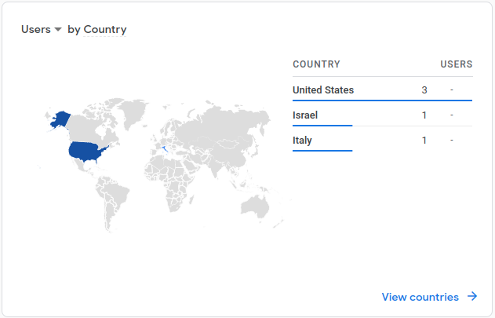

# Milestone 1

### Hosting

#### How many views did we have within the last 24 hours?

In the screenshot above taken from Google Cloud Logging, we can see that the website was hit 4 time in the last 24 hours.

#### How long is the request to load the page over the last 24 hours?
The four requests shown in the logging all show a 0ms response time, so at this level of specificity the average response time is 0ms.

#### How big is the request?
The requests size is 1.89KiB, as shown again in the logging.

#### What countries are accessing the website?
To show users who accessed the website, we can expand every request and look at the "remoteIpCountry" field, as shown below: 

However, I set up the Google Analytics Dashboard in the Firebase Console, which shows this information over the whole lifetime of the website in a nice and compact graph, which I have attached below, that shows that the website was accessed from three countries: US, Israel and Italy. 

